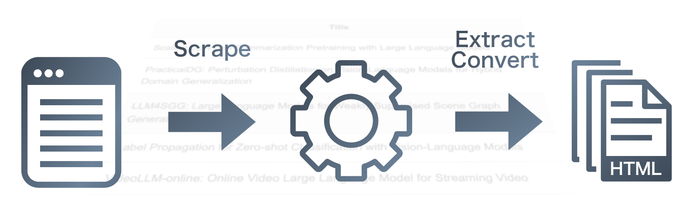

# cvpr-scraping


## environment

This example is for macOS or Linux. For more information, see the [official website](https://docs.python.org/ja/3/library/venv.html).
```bash
$ python -m venv .venv
$ source venv/bin/activate
$ pip install -r requirements.txt
```

## usage

### scrape and create csv file

For example, create csv file as "all.csv".

```bash
$ python3 scraping.py > all.csv
```

- format
	- title, url

### extract lines containg some word

For example, extract lines containg "language model" from "all.csv" and output to "extract.csv".

```bash
$ python3 extract.py all.csv "language model" > extract.csv
```

### create html file of paper titles

For example, create html file as "list.html" from "extract.csv".

```bash
$ python3 html.py extract.csv > list.html
```

### do all process (scraping, extracting, and creating html)

Using shell script. For example, extract lines containg "language model" and create html file as "list.html".

```bash
$ ./scraping_extract.sh list.html "language model"
```

You can omit the words to be extracted.

```bash
$ ./scraping_extract.sh list.html
```

If you omit html file name, html file is saved as "list.html". At that time, you can't specify the words to be extracted.

```bash
$ ./scraping_extract.sh
```

## specify the year to scrape

By default, the program scrapes papers for the year 2024.  To change the year, change the specifing year line of program `scraping.py`.  If there have been no changes to the program since this document was written, that is line 7.

```python
def main():
    # ウェブページからHTMLデータを取得
    year = 2024 # <<< change year to scrape
    url = 'https://openaccess.thecvf.com/CVPR' + str(year) + '?day=all'
    response = requests.get(url)
```
